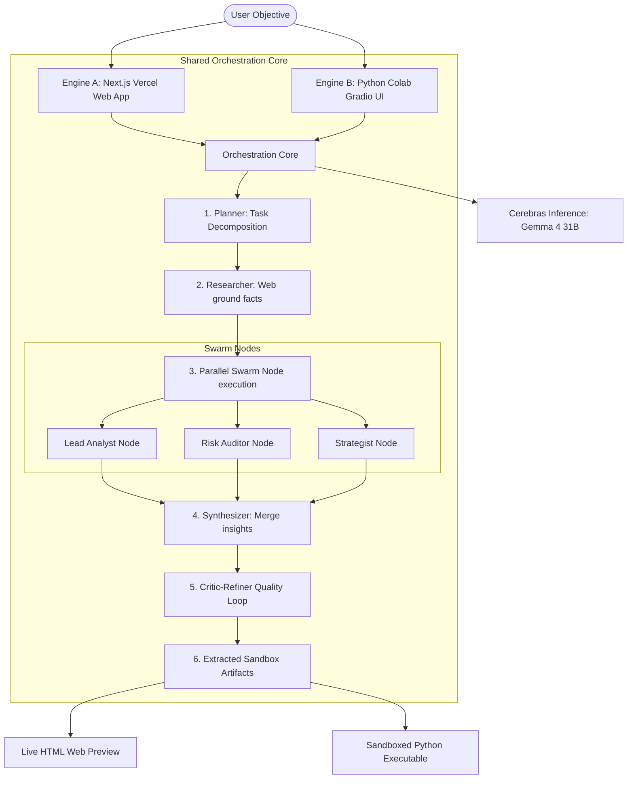

# Architecture: Ekathvam-OmniSwarm Twin-Engine Multi-Agent System

This document outlines the dual-engine architecture designed for the Cerebras x Google DeepMind Gemma 4 Hackathon.

## Twin-Engine Topology

### 1. Engine A: Vercel Edge Web Application
- **Runtime:** Vercel Edge Serverless functions (Node.js/TS).
- **Core Route:** `app/api/swarm/route.ts` manages streaming JSON telemetry down to the browser.
- **Frontend UI:** Glassmorphic layout with border glows, featuring the Cerebras Speed HUD, Swarm pipeline visualizer, and dual HTML preview & Python VM console.

### 2. Engine B: Google Colab & Gradio PoC
- **Runtime:** Isolated Jupyter/Colab VM (Python).
- **Core Script:** `engine-b/colab_orchestrator.py` provides a standalone Gradio interface, replicating the exact core multi-agent routing loop.
- **Purpose:** Assures technical judges of 100% reproducibility and code transparency.

## Grounding & Tools (ToolBox)
- The **Researcher** agent enriches tasks by querying a free, no-API-key DuckDuckGo scraper.
- Any Python code generated by the builder node can be executed via a sandboxed simulator in Engine A, or executed directly inside the Colab host shell in Engine B.

## Privacy & India DPDP Act 2023 Alignment
1. **BYO-Key Model:** Keys are entered in the client-side UI and held only in ephemeral memory (session scope).
2. **Stateless Passthrough:** The Edge backend never saves prompts, outputs, keys, or telemetry logs.
3. **WebCrypto Envelope:** Client encrypts payloads before transport via TLS.
4. **Verifiable Right to Erasure:** A cryptographically signed "Deletion Tombstone" receipt is returned when the user purges session state.
5. **Diduciary Mapping:** User is mapped as the **Data Fiduciary** and Ekathvam-OmniSwarm acts strictly as the **Data Processor**.
